# AI-Based Short-Term Electricity Load Forecasting

This portfolio project builds an AI-based forecasting pipeline for short-term electricity load prediction using the UCI ElectricityLoadDiagrams20112014 dataset.

The project is designed for smart energy, green technology, and AI-driven energy management applications, especially for roles related to smart grid operation, building energy management, renewable energy operation, storage scheduling, and electricity price optimization.

## Current Project Status

This repository is currently a working portfolio prototype rather than a
finished commercial energy platform.

| Area | Status | What is implemented |
|---|---|---|
| Dataset and EDA | Complete | UCI data loading, meter selection, daily/weekly patterns, autocorrelation, and EDA artifacts |
| Leakage-safe forecasting | Complete | Chronological 70/15/15 splits with target-boundary protection |
| Baseline models | Complete | Naive, Seasonal Naive, and multi-output Ridge |
| Interpretable ML | Complete | Direct per-step LightGBM, validation selection, feature importance, and SHAP diagnostics |
| Latest forecast workflow | Complete | 1h/24h CLI, refit on all labeled history, P10/P50/P90 scenarios, CSV/PNG/HTML/JSON reports |
| AI Agent layer | Scaffold complete | Disabled-by-default Provider interface, offline mock Agent, OpenAI-compatible API adapter, peak/uncertainty analysis |
| Robustness analysis | Complete | Deterministic noise, missing-block, spike, and distribution-shift scenarios with clean-future evaluation |
| Storage optimization | Complete | P10/P50/P90 battery dispatch, no-storage and rule baselines, HiGHS mixed-integer linear programming, CSV/PNG/JSON reports |
| Deep learning and dashboard | Planned | LSTM/GRU or Transformer, and Streamlit interface |

## System Architecture

```text
UCI or custom 15-minute load data
             |
             v
  data_loader + feature engineering
             |
             v
  chronological backtest and model selection
             |
             +--> Naive / Seasonal Naive / Ridge / LightGBM
             |
             v
  refit selected model on all labeled history
             |
             v
  point forecast + P10/P50/P90 scenarios
             |
             +--> CSV / PNG / interactive HTML / summary JSON
             |
             v
  forecast-driven storage optimizer
  (no-storage / rule baseline / HiGHS MILP battery dispatch)
             |
             +--> dispatch CSV / cost and peak metrics / P50 chart
             |
             v
  optional AI Agent
  (explain peak, uncertainty, model comparison, and operations)
```

The numerical forecasting layer and the language-model layer are deliberately
separated. The forecasting models produce auditable load values and metrics.
The Agent consumes those results and generates interpretation or operational
recommendations; it does not replace the evaluated time-series model or
silently modify its predictions.

## How The Code Is Organized

- `src/data_loader.py`: validates wide UCI files and normalized custom CSVs.
- `src/features.py`: builds calendar, holiday, lag, and rolling features.
- `src/forecasting.py`: creates multi-step targets and leakage-safe splits.
- `src/baselines.py`: implements Naive, Seasonal Naive, and Ridge baselines.
- `src/ml_models.py`: fits direct LightGBM models and quantile intervals.
- `src/inference.py`: selects the validation winner, refits it, and creates the latest forecast.
- `src/robustness.py`: applies deterministic data stress scenarios and evaluates them against an untouched historical future.
- `src/storage_optimization.py`: validates battery/tariff assumptions and runs baseline or HiGHS mixed-integer linear programming dispatch.
- `src/reporting.py`: publishes machine-readable and visual forecast artifacts.
- `src/ai_config.py` and `src/ai_provider.py`: define the disabled, mock, and OpenAI-compatible Agent providers.
- `src/agent.py`: builds a JSON-safe context containing forecast peaks, uncertainty, model comparison, and recent load information.
- `analyze_latest.py`: runs the Agent against a saved report without rerunning the numerical forecast.
- `optimize_storage.py`: turns a saved 24-hour forecast into atomic storage-dispatch report artifacts.

## End-To-End Example

Run the numerical forecast first, then run the offline Agent analysis:

```powershell
python predict_latest.py --horizon 1h
python analyze_latest.py --report-dir reports/predictions/MT_252/1h --provider mock
```

The first command creates the forecast and evaluation reports. The second
creates `agent_analysis.json` from those saved reports. On the current UCI
example, LightGBM wins validation for both horizons; however, the untouched
24-hour test split still favors Seasonal Naive. That result is intentionally
reported rather than hidden, because honest baseline comparison is part of the
project's research value.

## Project Goals

- Forecast future electricity load for a selected client or meter.
- Support two forecasting horizons:
  - 1-hour ahead forecasting: 4 future 15-minute steps.
  - 24-hour ahead forecasting: 96 future 15-minute steps.
- Use historical load, calendar features, weekday/weekend indicators, holiday flags, lag features, and rolling statistics.
- Compare simple baselines, machine learning models, and later deep learning models.
- Add robustness analysis under sensor noise, missing data, abnormal peaks, and distribution shift.

## Dataset

Dataset: UCI ElectricityLoadDiagrams20112014

Original source: https://archive.ics.uci.edu/dataset/321/electricityloaddiagrams20112014

Citation: Trindade, A. (2015). ElectricityLoadDiagrams20112014 [Dataset]. UCI
Machine Learning Repository. https://doi.org/10.24432/C58C86. License: CC BY 4.0.

The dataset contains electricity consumption time series for multiple clients. The original data is recorded at 15-minute intervals, which makes it suitable for short-term load forecasting.

Place the raw dataset file under:

```text
data/raw/
```

See `data/README.md` for download and placement instructions.

## Quick Start

```powershell
python -m venv .venv
.\.venv\Scripts\Activate.ps1
python -m pip install -r requirements.txt
python -m nbconvert --to notebook --execute --inplace notebooks\01_eda.ipynb
python -m nbconvert --to notebook --execute --inplace notebooks\02_baseline_models.ipynb --ExecutePreprocessor.timeout=1800
python -m nbconvert --to notebook --execute --inplace notebooks\03_ml_models.ipynb --ExecutePreprocessor.timeout=3600
python -m pytest -v
```

In VS Code, select `.venv\Scripts\python.exe` as the notebook kernel and open
`notebooks/01_eda.ipynb`, `notebooks/02_baseline_models.ipynb`, then
`notebooks/03_ml_models.ipynb`.

## Forecasting Definition

### Prediction Task

Predict the future electricity load of a selected client or meter.

### Input

- Historical electricity load
- Time features:
  - hour
  - day of week
  - month
  - weekend indicator
- Holiday indicator
- Lag features
- Rolling mean and rolling standard deviation features

### Output

- Future electricity load trajectories for `MT_252`.
- Main horizon: 1 hour ahead, represented as 4 future 15-minute steps.
- Extended horizon: 24 hours ahead, represented as 96 future 15-minute steps.
- Chronological 70/15/15 train/validation/test splitting prevents target
  vectors from crossing partition boundaries.

### Application Scenarios

- Smart grid dispatching
- Building energy management
- Renewable energy operation planning
- Energy storage scheduling
- Electricity price optimization

## Initial EDA Results

The first analysis selects `MT_252` as a representative client: among meters
with non-zero demand in at least 99% of intervals, its mean demand is closest
to the group median. This avoids both late-starting meters and unusually large
industrial loads.

Key findings:

- Data shape: 140,256 timestamps x 370 clients, from 2011-01-01 to 2015-01-01.
- Selected meter mean and standard deviation: 232.63 kW and 82.16 kW.
- Average off-peak hour: 03:00; average peak hour: 18:00.
- Weekend mean demand is only 1.32% above weekday mean demand for this meter.
- 1-hour lag autocorrelation: 0.896; 24-hour lag autocorrelation: 0.954.
- Brief near-zero drops in the example week are candidates for later anomaly
  and robustness analysis; they should not be labeled as faults without more
  operational context.

The strong 24-hour autocorrelation supports a seasonal-naive baseline and
`lag_96`. The high 1-hour autocorrelation supports `lag_4`. The small weekend
gap suggests that time-of-day and lag features may be more informative than a
weekend flag for this particular client.

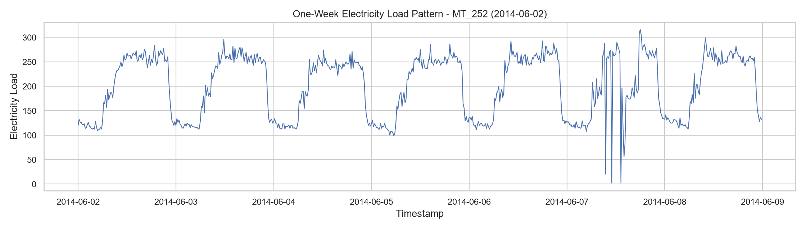

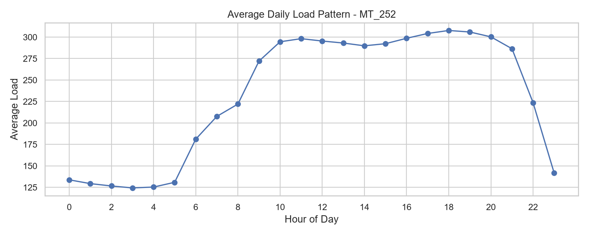

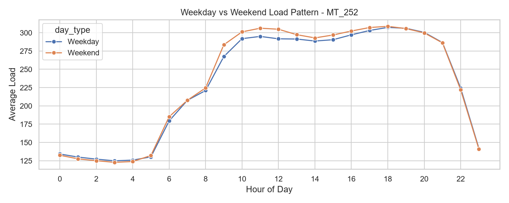

The machine-readable summary is saved at `reports/tables/eda_summary.csv`.

## Multi-Step Baseline Results

This stage predicts complete future trajectories for `MT_252`: 4 values for
the next hour and 96 values for the next 24 hours. Features use only information
available at or before the forecast origin, including lags `1, 4, 96, 192, 672`,
shifted rolling windows `4, 96, 672`, calendar encodings, weekend flags, and
Portugal holiday flags. The experiment uses chronological 70/15/15 splitting
with target-boundary leakage prevention.

Metrics are evaluated on the final chronological 15% test split. MAE, RMSE, and
Endpoint_MAE are in kW; MAPE is percent. MAE and RMSE summarize all forecast
steps, while Endpoint_MAE measures only the final step of each trajectory.

| Horizon | Model | MAE (kW) | RMSE (kW) | MAPE (%) | Endpoint MAE (kW) |
|---|---|---:|---:|---:|---:|
| 1h | Naive | 16.97 | 27.09 | 10.38 | 21.56 |
| 1h | Seasonal Naive | 15.40 | 24.91 | 9.44 | 15.39 |
| 1h | Ridge | 16.24 | 22.76 | 10.03 | 20.18 |
| 24h | Naive | 75.09 | 96.87 | 44.87 | 15.42 |
| 24h | Seasonal Naive | 15.33 | 24.72 | 9.40 | 15.42 |
| 24h | Ridge | 24.38 | 31.95 | 14.57 | 14.38 |

Ridge is implemented as a direct multi-output model: one fitted estimator
predicts every future step in the horizon. Alpha is selected on validation MAE
only from `[0.1, 1.0, 10.0, 100.0]`; the selected model is then evaluated once
on the test split without refitting on validation data.

| Horizon | Selected Ridge Alpha | Validation MAE (kW) |
|---|---:|---:|
| 1h | 0.10 | 17.45 |
| 24h | 0.10 | 26.06 |

Seasonal Naive has the lowest overall MAE for both horizons. Ridge has lower
1h RMSE than Naive and the lowest 24h Endpoint_MAE, but it does not beat
Seasonal Naive on overall MAE. The per-step table shows Naive and Ridge errors
increasing across the 1h horizon, while Seasonal Naive stays nearly flat across
the four 1h steps. For 24h, Seasonal Naive stays nearly flat across lead times;
Naive grows to its largest MAE around step 48 and then declines by the endpoint;
Ridge starts with the lowest first-step MAE, rises through the middle of the
horizon, and declines toward the final step.

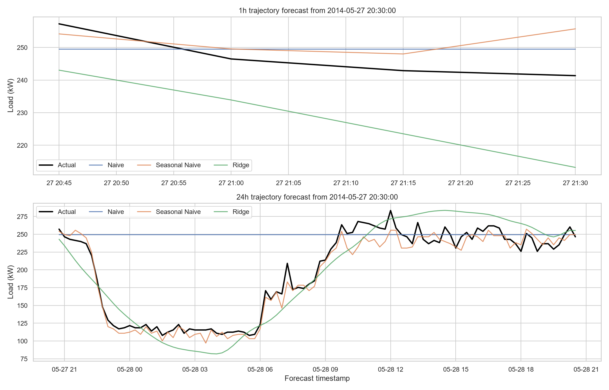

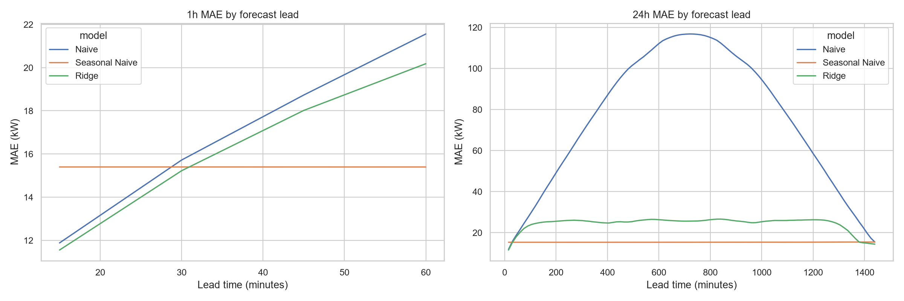

## Interpretable Machine Learning Results

Week 3 adds direct per-step LightGBM forecasting for both horizons. The model
uses one LightGBM regressor per forecast lead, so the 1h task fits 4 models and
the 24h task fits 96 models. Candidate selection is performed only on the
chronological validation split; the selected candidate is then evaluated once on
the held-out test split.

Metrics below are measured on the final chronological 15% test split. MAE,
RMSE, and Endpoint_MAE are in kW; MAPE and improvement are percentages.
LightGBM improvement is measured against Seasonal Naive overall MAE, where a
positive value means lower MAE than Seasonal Naive and a negative value means
higher MAE.

| Horizon | Model | MAE (kW) | RMSE (kW) | MAPE (%) | Endpoint MAE (kW) | LightGBM improvement vs Seasonal Naive |
|---|---|---:|---:|---:|---:|---:|
| 1h | Naive | 16.97 | 27.09 | 10.38 | 21.56 | - |
| 1h | Seasonal Naive | 15.40 | 24.91 | 9.44 | 15.39 | - |
| 1h | Ridge | 16.24 | 22.76 | 10.03 | 20.18 | - |
| 1h | LightGBM | 12.69 | 18.21 | 8.87 | 13.46 | +17.56% |
| 24h | Naive | 75.09 | 96.87 | 44.87 | 15.42 | - |
| 24h | Seasonal Naive | 15.33 | 24.72 | 9.40 | 15.42 | - |
| 24h | Ridge | 24.38 | 31.95 | 14.57 | 14.38 | - |
| 24h | LightGBM | 18.09 | 26.74 | 12.26 | 14.65 | -18.04% |

| Horizon | Selected LightGBM Candidate | num_leaves | learning_rate | n_estimators | min_child_samples | reg_lambda | Validation MAE (kW) |
|---|---|---:|---:|---:|---:|---:|---:|
| 1h | medium | 31 | 0.05 | 400 | 20 | 0.10 | 10.98 |
| 24h | small | 15 | 0.05 | 300 | 40 | 1.00 | 13.78 |

LightGBM is the measured overall-MAE winner for the 1h horizon with 12.69 kW,
improving 17.56% over Seasonal Naive. Seasonal Naive remains the measured
overall-MAE winner for the 24h horizon with 15.33 kW; the 24h LightGBM model is
18.04% worse than Seasonal Naive on overall MAE, although its endpoint MAE is
slightly lower than Seasonal Naive.

Gain importance and SHAP summaries are interpretability diagnostics, not causal
evidence. The 1h LightGBM gain table is dominated by `current_load`
(normalized gain 0.68), with time-of-day and short lag features next. The 24h
gain table is led by `hour_cos` and `hour_sin` (normalized gains 0.34 and
0.30), followed by daily rolling load context and recent load. The SHAP plots
show similar non-causal associations: near-term forecast steps lean heavily on
current load, while longer 24h leads place more weight on time-of-day signals,
rolling demand levels, and lagged load features.

The Week 3 implementation lives in `notebooks/03_ml_models.ipynb`,
`src/ml_models.py`, and `tests/test_ml_models.py`. Machine-readable LightGBM
outputs are saved at `reports/tables/ml_model_metrics.csv`,
`reports/tables/ml_metrics_by_step.csv`,
`reports/tables/lgbm_parameter_search.csv`, and
`reports/tables/lgbm_feature_importance.csv`.

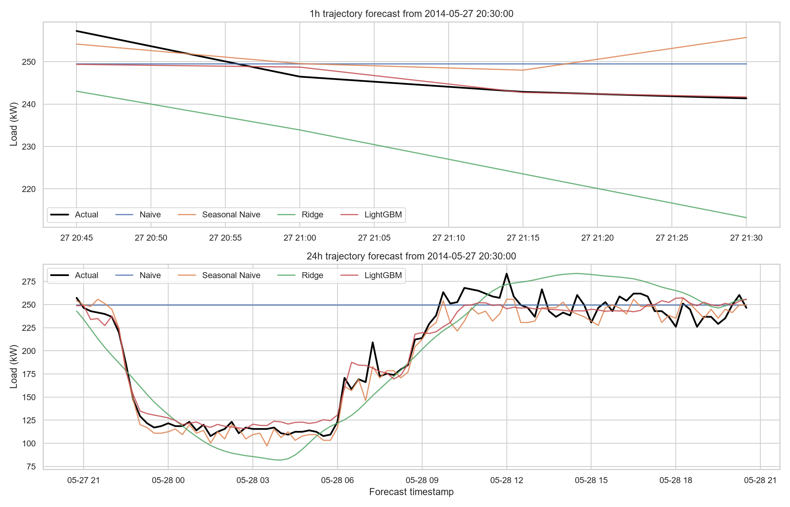

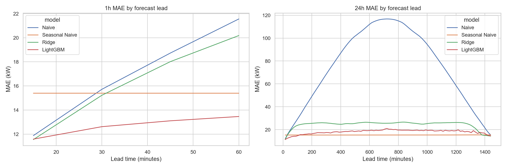

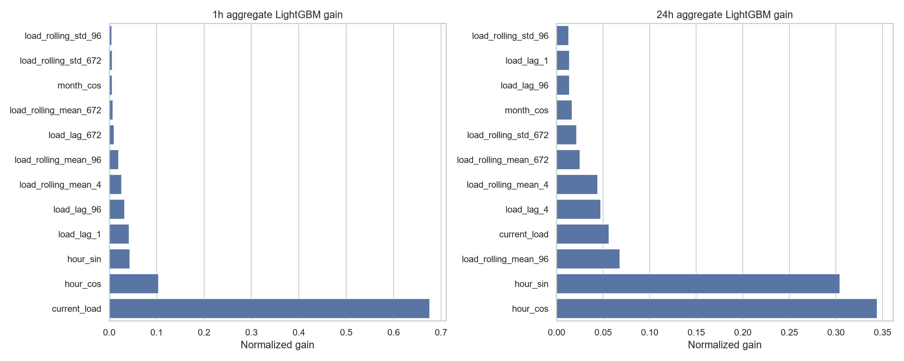

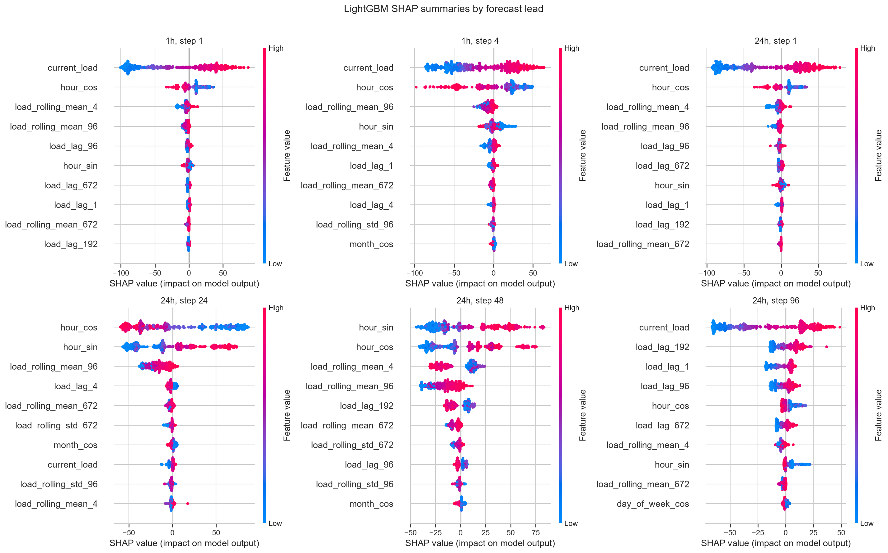

## Latest Forecast CLI

```powershell
python predict_latest.py --horizon 1h
python predict_latest.py --horizon 24h
python predict_latest.py --input data/raw/LD2011_2014.txt --meter MT_252 --horizon 1h
python predict_latest.py --horizon 24h --search
python predict_latest.py --input data/custom/hk_building.csv --holiday-country HK --horizon 24h
```

The command selects Naive, Seasonal Naive, Ridge, or LightGBM using validation
MAE, reports untouched chronological test metrics, and then refits the selected
family on all labeled history for the latest forecast. P10, P50, and P90 show
lower, median, and upper empirical load scenarios; they are not guaranteed
coverage bounds.

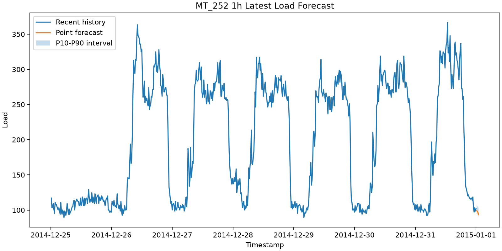

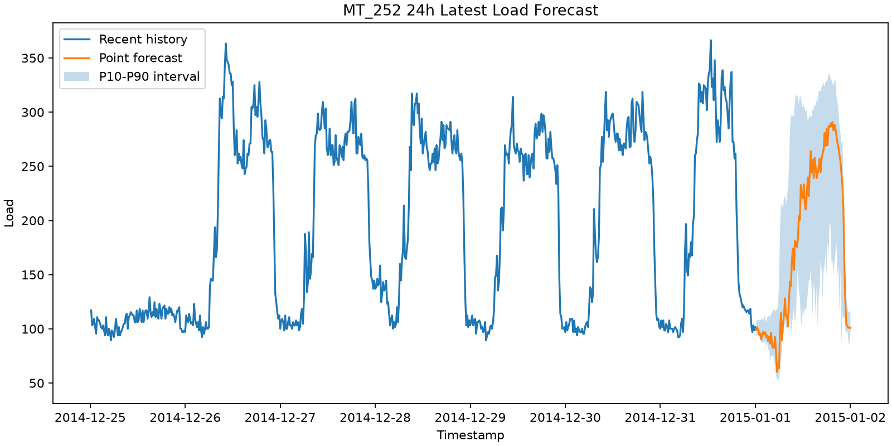

The generated reports measured LightGBM as the validation winner for both
horizons. LightGBM is not forced to win: on the untouched 24h test split,
Seasonal Naive remains lower at 15.33 kW MAE versus LightGBM at 18.09 kW MAE.

| Horizon | Selected model | Validation MAE (kW) | Untouched test MAE (kW) | Reports |
|---|---|---:|---:|---|
| 1h | LightGBM | 10.98 | 12.69 | [forecast.csv](reports/predictions/MT_252/1h/forecast.csv), [model_comparison.csv](reports/predictions/MT_252/1h/model_comparison.csv), [summary.json](reports/predictions/MT_252/1h/summary.json), [forecast.html](reports/predictions/MT_252/1h/forecast.html) |
| 24h | LightGBM | 13.78 | 18.09 | [forecast.csv](reports/predictions/MT_252/24h/forecast.csv), [model_comparison.csv](reports/predictions/MT_252/24h/model_comparison.csv), [summary.json](reports/predictions/MT_252/24h/summary.json), [forecast.html](reports/predictions/MT_252/24h/forecast.html) |

## Forecast-Driven Storage Optimization

The 24-hour forecast can drive a battery scheduling decision without changing
the numerical forecast model. The optimizer runs all P10/P50/P90 trajectories
through three strategies: no storage, a transparent tariff-rule baseline, and
a mixed-integer linear programming (MILP) schedule solved by SciPy HiGHS. It
minimizes energy cost, a configurable peak-import penalty, and small
battery-throughput cost while enforcing power limits, state-of-charge limits,
round-trip efficiency, non-negative grid import, and terminal state of charge.
One binary charge/discharge mode per 15-minute interval enforces mutually
exclusive battery activity.

Run the saved UCI forecast through the optimizer:

```powershell
python optimize_storage.py --forecast-dir reports/predictions/MT_252/24h
```

This produces [dispatch.csv](reports/optimization/MT_252/24h/dispatch.csv),
[optimization_summary.json](reports/optimization/MT_252/24h/optimization_summary.json),
and the chart below. Publication is atomic: artifacts are first validated in a
temporary sibling directory, then moved into the destination directory.

The committed portfolio run uses a 500 kWh battery, 100 kW charge/discharge
limits, 10%-90% SOC range, 90% round-trip efficiency, and a 50% terminal SOC.
Its time-of-use tariff is intentionally marked `synthetic_demo`: off-peak
0.60, shoulder 1.00, and peak 1.50 units/kWh, plus a 5.00 units/kW peak-import
penalty. Replace these parameters with a site-specific tariff and battery
datasheet before using the output operationally.

| P50 strategy | Energy cost (units) | Peak import (kW) | Peak reduction vs no storage |
|---|---:|---:|---:|
| No storage | 4503.47 | 288.56 | 0.00 kW |
| Rule baseline | 4221.57 | 312.99 | -24.42 kW |
| MILP optimized | 4298.29 | 223.41 | 65.15 kW (22.58%) |

For the P50 trajectory, HiGHS MILP dispatch saves 205.18 energy-cost units (4.56%)
and lowers the peak by 65.15 kW under those demo assumptions. The rule
baseline is deliberately simple and can increase the peak; it is retained as
an honest benchmark rather than presented as a production policy.

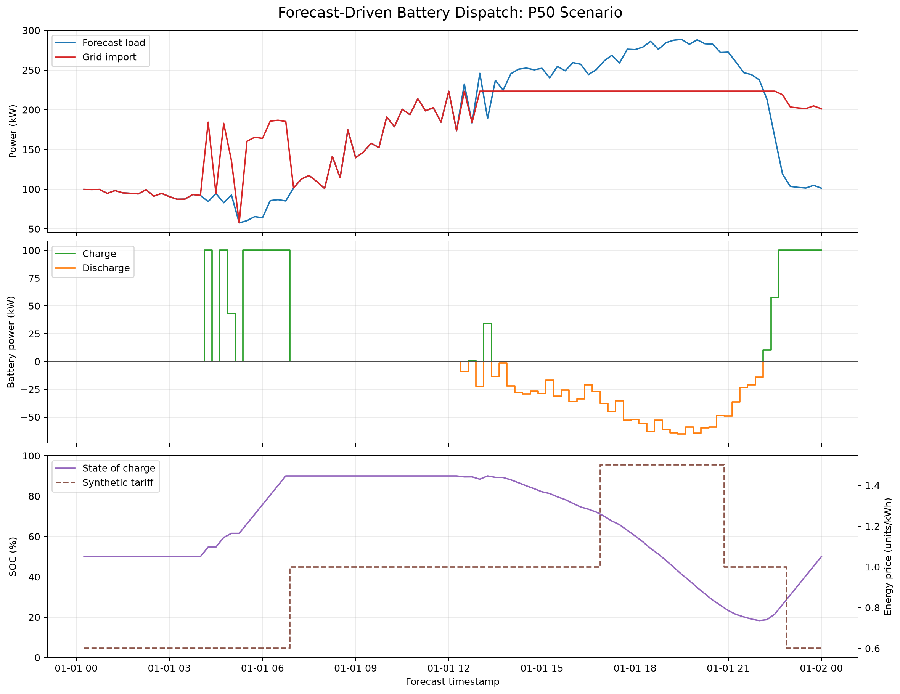

## Robustness Analysis

Run deterministic stress tests against an untouched historical future:

```powershell
python robustness_analysis.py --horizon 1h
python robustness_analysis.py --horizon 24h
python robustness_analysis.py --horizon 1h --seed 7 --scenarios sensor_noise_5pct,missing_blocks_1pct
```

Each run truncates the time series before a known future horizon, perturbs only
the observed prefix, runs the normal model-selection and refit pipeline, and
scores the prediction against the clean future. The original dataset and the
evaluation target are never modified. Outputs include a scenario-level CSV,
JSON metadata, and a comparison chart.

| Horizon | Scenario | MAE (kW) | RMSE (kW) | MAE change vs clean |
|---|---|---:|---:|---:|
| 1h | Clean | 3.34 | 3.59 | 0.0% |
| 1h | Sensor noise (5% std) | 2.30 | 2.72 | -31.2% |
| 1h | Missing one-hour blocks (1%) | 3.71 | 3.91 | +11.1% |
| 1h | Abnormal spikes (1%) | 3.35 | 4.76 | +0.2% |
| 1h | Recent distribution shift (+10%) | 9.53 | 10.69 | +185.4% |
| 24h | Clean | 42.53 | 62.06 | 0.0% |
| 24h | Sensor noise (5% std) | 44.01 | 63.23 | +3.5% |
| 24h | Missing one-hour blocks (1%) | 42.36 | 61.89 | -0.4% |
| 24h | Abnormal spikes (1%) | 42.13 | 62.29 | -0.9% |
| 24h | Recent distribution shift (+10%) | 40.92 | 65.32 | -3.8% |

The 1h result exposes a clear weakness to recent distribution shift. The 24h
result is more mixed: distribution shift lowers MAE at this particular origin
but raises RMSE and MAPE, so it is not evidence that the shift is beneficial.
Likewise, the lower noisy 1h MAE is a single-origin outcome, not a general
regularization claim. These experiments are reproducible sensitivity tests;
multi-origin backtesting is the next step before making statistical robustness
claims.

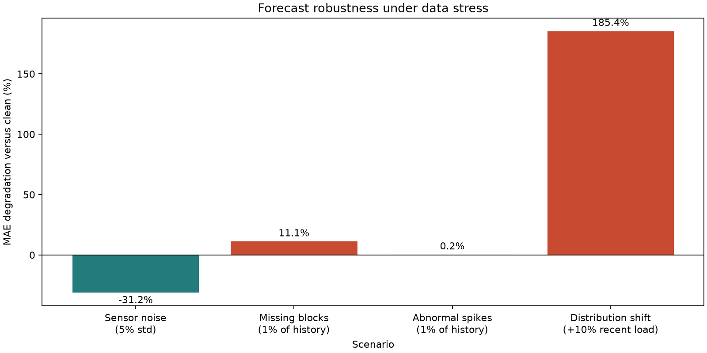

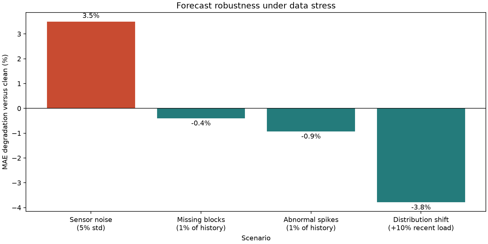

Machine-readable results: [1h metrics](reports/robustness/MT_252/1h/robustness_metrics.csv)
and [24h metrics](reports/robustness/MT_252/24h/robustness_metrics.csv).

## Optional AI Agent Layer

The project uses a hybrid design: LightGBM and the baseline models produce the
numeric load forecast, while an optional Agent interprets the saved forecast,
compares model results, identifies peak and uncertainty signals, and prepares
energy-management recommendations. The Agent never overwrites the numeric
forecast.

The repository has no mandatory external AI service. The default provider is
`disabled`, and `mock` is available for an offline portfolio demo:

```powershell
python analyze_latest.py --report-dir reports/predictions/MT_252/1h --provider disabled
python analyze_latest.py --report-dir reports/predictions/MT_252/1h --provider mock
```

Both commands write `agent_analysis.json` into the report directory. The
generated mock example is available at
`reports/predictions/MT_252/1h/agent_analysis.json`.

For a future hosted API, use an OpenAI-compatible Chat Completions endpoint.
Keep the key in the process environment rather than the repository:

```powershell
$env:ENERGY_AI_PROVIDER = "openai-compatible"
$env:ENERGY_AI_BASE_URL = "https://api.example.com/v1"
$env:ENERGY_AI_MODEL = "your-model-name"
$env:ENERGY_AI_API_KEY = "your-api-key"
python analyze_latest.py --report-dir reports/predictions/MT_252/1h
```

For local deployment at home, the handoff target is Qwen3 served by Ollama or
vLLM. Both expose OpenAI-compatible interfaces, so the project can keep the
same client contract; only `ENERGY_AI_BASE_URL`, `ENERGY_AI_MODEL`, and
`ENERGY_AI_API_KEY` change. Select the model size after checking the home
desktop GPU memory. See the [Qwen quickstart](https://qwen.readthedocs.io/en/stable/getting_started/quickstart.html),
[Ollama OpenAI compatibility guide](https://docs.ollama.com/api/openai-compatibility),
and [vLLM OpenAI-compatible server guide](https://docs.vllm.ai/en/latest/serving/online_serving/openai_compatible_server/).

## Repository Structure

```text
energy-load-forecasting/
  README.md
  requirements.txt
  .gitignore
  .env.example
  predict_latest.py
  analyze_latest.py
  robustness_analysis.py
  optimize_storage.py
  data/
    README.md
    raw/
    processed/
  notebooks/
    01_eda.ipynb
    02_baseline_models.ipynb
    03_ml_models.ipynb
    README.md
  src/
    __init__.py
    baselines.py
    config.py
    data_loader.py
    evaluate.py
    features.py
    forecasting.py
    ml_models.py
    robustness.py
    storage_optimization.py
    ai_config.py
    ai_provider.py
    agent.py
  tests/
    test_baselines.py
    test_evaluate.py
    test_features.py
    test_forecasting.py
    test_ml_models.py
    test_robustness.py
    test_robustness_cli.py
    test_storage_optimization.py
    test_storage_cli.py
  reports/
    figures/
      average_daily_pattern.png
      baseline_forecast_examples.png
      lgbm_feature_importance.png
      lgbm_forecast_examples.png
      lgbm_mae_by_step.png
      lgbm_shap_summary.png
      baseline_mae_by_step.png
      week_load_pattern.png
      weekday_vs_weekend_pattern.png
    tables/
      baseline_metrics.csv
      baseline_metrics_by_step.csv
      eda_summary.csv
      lgbm_feature_importance.csv
      lgbm_parameter_search.csv
      ml_metrics_by_step.csv
      ml_model_metrics.csv
      ridge_alpha_selection.csv
  docs/
    superpowers/
      plans/
      specs/
  GITHUB_GUIDE.md
```

## Planned Roadmap

### Week 1: Data Understanding and EDA (Completed)

- Load the UCI electricity load dataset.
- Parse timestamps.
- Select one or several representative clients.
- Visualize daily and weekly load patterns.
- Identify peak and off-peak periods.

### Week 2: Baseline Models (Completed)

- Naive baseline completed.
- Seasonal naive baseline completed.
- Direct multi-output Ridge Regression completed.
- Chronological 70/15/15 train/validation/test split completed with
  target-boundary leakage prevention.

### Week 3: Machine Learning Models (Completed)

- Direct per-step LightGBM forecasters completed for 1h and 24h horizons.
- Validation-only LightGBM candidate selection completed for each horizon.
- Test-set comparison completed against Naive, Seasonal Naive, and Ridge
  baselines.
- Gain-based feature importance completed and exported.
- SHAP summary diagnostics completed for selected forecast leads.

### Week 4-5: Deep Learning Models

- LSTM.
- GRU.
- Optional Transformer model.

### Week 6: Robustness Analysis (Completed)

- Deterministic noise disturbance completed.
- Contiguous missing-data blocks with interpolation completed.
- Abnormal peak injection completed.
- Recent distribution shift completed.
- Clean-future 1h and 24h sensitivity reports completed.

### Week 7: Storage Optimization (Completed)

- P10/P50/P90 forecast-to-dispatch orchestration completed.
- No-storage and tariff-rule baselines completed.
- Forecast-driven HiGHS MILP battery dispatch completed.
- Atomic CSV, JSON, and P50 chart publication completed.
- One binary mode per 15-minute interval enforces mutually exclusive
  charge/discharge activity.
- Next optimization upgrade: site-specific tariff/battery inputs.

### Week 8: Dashboard

- Streamlit demo for visualizing forecasts, errors, and energy insights.

### Week 9: Portfolio Packaging

- Polish README.
- Add project summary.
- Prepare CV bullet points and interview pitch.

## How To Define Similar Projects For Codex

When asking Codex to help with a forecasting or AI project, define it like this:

```text
Project name:
Dataset:
Prediction target:
Time granularity:
Forecasting horizon:
Input features:
Output:
Model scope:
Application scenario:
Final use:
First step I want Codex to do:
```

For this project:

```text
Project name: AI-Based Short-Term Electricity Load Forecasting
Dataset: UCI ElectricityLoadDiagrams20112014
Prediction target: Electricity load of a selected client or meter
Time granularity: 15-minute raw data
Forecasting horizon: 1 hour and 24 hours
Input features: historical load, time features, weekday/weekend, holiday flag, lag features, rolling statistics
Output: future electricity load value
Model scope: naive baseline, seasonal naive, Ridge, Random Forest, XGBoost or LightGBM, later LSTM/GRU
Application scenario: smart grid dispatching, building energy management, storage and price optimization
Final use: GitHub portfolio, professor outreach, and Hong Kong green technology job applications
First step I want Codex to do: create project structure and EDA notebook
```

## Portfolio Positioning

This project connects a Computer Science background with green energy applications. It can be described as an AI-driven smart energy project that uses time-series forecasting and robustness evaluation to support reliable energy management decisions.

## Publish To GitHub

Follow `GITHUB_GUIDE.md`. Raw data and virtual environments are excluded, while
the executed notebook, charts, and summary table are included for reviewers.
