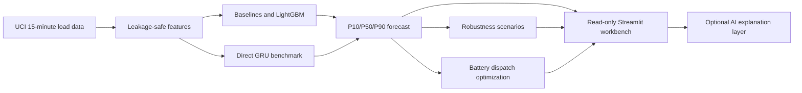

# Portfolio Guide

This document is the short version of the project for a GitHub reviewer,
research supervisor, or smart-energy employer.

## One-Sentence Summary

An AI-assisted short-term electricity-load forecasting system that compares
classical models and a GRU, quantifies uncertainty and data-quality risk, and
feeds the forecast into a battery-dispatch optimization workflow.

## Why This Project Matters

The project connects computer science and energy operations through a clear
decision chain:



The numerical models remain auditable. The optional AI layer explains saved
results and operating risks; it is not allowed to silently change forecasts or
dispatch decisions.

## Evidence From The Current Run

All values below are from the untouched chronological test split for `MT_252`.
They describe this experiment, not a universal ranking of algorithms.

| Horizon | Model | Test MAE (kW) | Test RMSE (kW) | Reading |
|---|---|---:|---:|---|
| 1h | Seasonal Naive | 15.40 | 24.91 | Strong short seasonal baseline |
| 1h | LightGBM | 12.69 | 18.21 | Better than the 1h seasonal baseline in this run |
| 1h | GRU | 11.96 | 17.10 | Best 1h result in the current benchmark |
| 24h | Seasonal Naive | 15.33 | 24.72 | Best overall 24h MAE in this run |
| 24h | LightGBM | 18.09 | 26.74 | Validation winner, but weaker on untouched test data |
| 24h | GRU | 18.55 | 27.37 | Competitive benchmark, not the best 24h model |

The important finding is the validation/test mismatch at 24 hours. The system
reports it instead of selecting a model from the test set or hiding a weaker
result. That is the project's main methodological strength.

## AI And Energy Connection

The current AI components are:

- LightGBM feature-based forecasting for nonlinear calendar and lag effects.
- GRU sequence modelling for an independent deep-learning benchmark.
- Lead-wise residual calibration for P10/P50/P90 uncertainty intervals.
- A disabled-by-default Agent interface that summarizes peaks, uncertainty,
  model comparison, and robustness results from saved JSON/CSV artifacts.
- A Forecast-tab offline mock Agent interpretation for a no-API portfolio
  demonstration.

The next AI extension is to connect the Agent to a fixed company-approved API
or a local model. The dashboard currently uses an offline mock interpretation
and does not call an external API. A future OpenAI-compatible endpoint can be
enabled with `ENERGY_AI_PROVIDER`, `ENERGY_AI_BASE_URL`, and `ENERGY_AI_MODEL`
after the endpoint is available.

## Demo Path

```powershell
python -m pip install -r requirements.txt
python -m streamlit run dashboard.py
```

Open `http://localhost:8501` and inspect:

1. **Forecast**: switch between Classical and GRU, inspect P10/P50/P90, and
   read the offline mock Agent interpretation.
2. **Model Comparison**: compare validation and untouched-test errors.
3. **Robustness**: inspect degradation under missing blocks, spikes, noise,
   and distribution shift.
4. **Storage**: inspect P50 battery dispatch and cost/peak metrics.

Dashboard screenshots are stored in `reports/dashboard/` and can be linked
directly from the repository or copied into a slide deck.

The storage section uses a clearly labelled `synthetic_demo` tariff and battery
configuration. It demonstrates the optimization interface, not a site-specific
commercial dispatch recommendation.

## Resume Bullets

Use the bullets that match the role. Do not claim production deployment or
real-time grid control.

- Built a leakage-safe 15-minute electricity-load forecasting pipeline on the
  UCI ElectricityLoadDiagrams20112014 dataset, supporting 1-hour and 24-hour
  multi-step prediction with Naive, Ridge, LightGBM, and GRU baselines.
- Added validation-calibrated P10/P50/P90 intervals and deterministic
  robustness tests for sensor noise, missing blocks, spikes, and distribution
  shift; published machine-readable reports and a Streamlit decision-support
  dashboard.
- Connected probabilistic forecasts to a HiGHS MILP battery-dispatch workflow
  with no-storage and rule-based baselines, exposing cost, peak-import, SOC,
  and dispatch trade-offs under synthetic demonstration assumptions.

## Two-Minute Interview Explanation

“I built a short-term load forecasting system for a representative UCI meter.
The raw data is recorded every 15 minutes, so the 1-hour and 24-hour tasks
predict 4 and 96 future points. I used chronological splits and protected the
target boundary to prevent leakage. LightGBM performed well for the 1-hour
case, while Seasonal Naive remained stronger for the 24-hour test split; a GRU
was competitive and best in the current 1-hour benchmark. I then calibrated
prediction intervals, tested sensitivity to data-quality problems, and passed
the forecast to a battery optimizer. The dashboard is read-only, and an Agent
can be connected later to explain saved results without replacing the numeric
models.”

## Honest Next Upgrades

- Rolling-origin evaluation across multiple forecast origins.
- Site-specific tariff, battery limits, and real operational constraints.
- API/local-model Agent provider with structured output validation.
- Monitoring for forecast drift and interval coverage after deployment.
